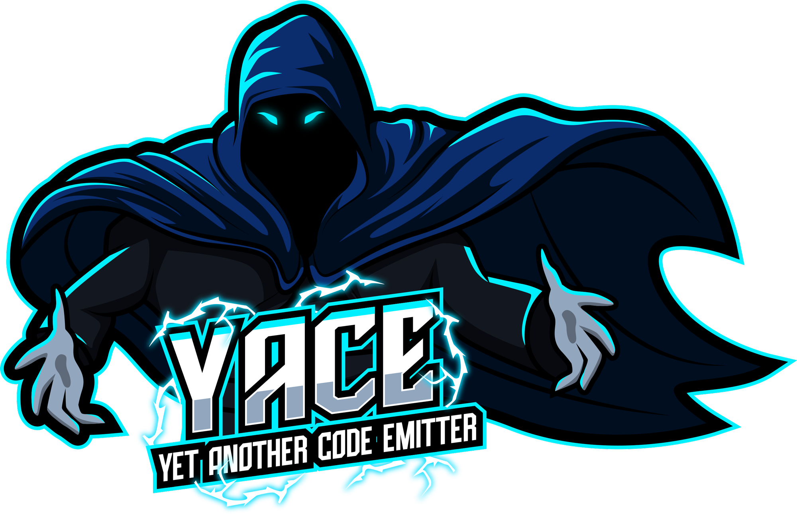

Welcome to yace
===============

.. image:: https://img.shields.io/pypi/v/yace.svg
   :target: https://pypi.org/project/yace
   :alt: PyPI

.. image:: https://github.com/safl/yace/actions/workflows/build_deploy.yml/badge.svg
   :target: https://github.com/safl/yace/actions
   :alt: Build Status

.. image:: https://coveralls.io/repos/github/safl/yace/badge.svg?branch=main
   :target: https://coveralls.io/github/safl/yace?branch=main

.. image:: https://img.shields.io/badge/pre--commit-enabled-brightgreen?logo=pre-commit
   :target: https://github.com/safl/yace/blob/main/.pre-commit-config.yaml
   :alt: pre-commit

**yace** is a foreign-function-interface (FFI) compiler designed to ease the
development and maintenance of C APIs, their libraries and the
FFI-bindings/wrappers using them.

* The project is hosted on `GitHUB`_

* Documentation is available at `safl.dk/yace`_

**yace** is a new project, with a bunch of things it want to get done, why?
Because there are some projects that need a better way to handle C headers and
libraries bindings. If you want to help out, then don't be shy, there are
plenty of things to do.

.. _GitHUB: https://github.com/safl/yace
.. _safl.dk/yace: https://safl.dk/yace

